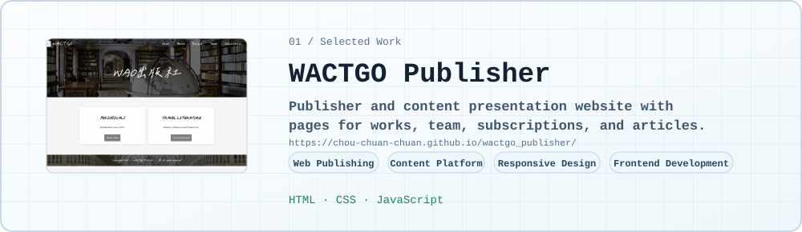
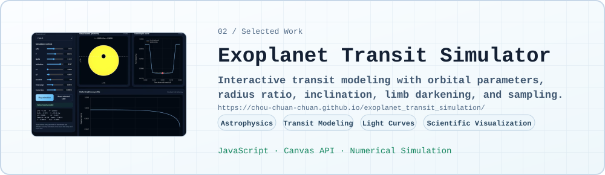
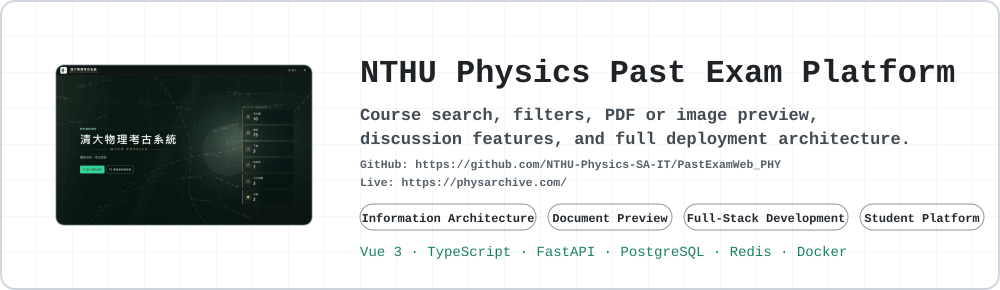

<picture>
  <source media="(prefers-color-scheme: dark)" srcset="assets/profile-header-dark.svg">
  <source media="(prefers-color-scheme: light)" srcset="assets/profile-header-light.svg">
  
</picture>

## 01 / Profile

Physics student building scientific simulations, interactive visualizations, and accessible web systems.

```text
Physics          -> understand the system
Simulation       -> model the system
Visualization    -> reveal the behavior
Web              -> make it accessible
```

I work across physics, numerical thinking, visual interface design, and web architecture. My projects focus on turning structured scientific or educational systems into interactive tools that are easier to explore, inspect, and use.

## 02 / Selected Work

<a href="https://github.com/chou-chuan-chuan/wactgo_publisher">
  <picture>
    <source media="(prefers-color-scheme: dark)" srcset="assets/projects/wactgo-dark.svg">
    <source media="(prefers-color-scheme: light)" srcset="assets/projects/wactgo-light.svg">
    
  </picture>
</a>

<a href="https://github.com/chou-chuan-chuan/exoplanet_transit_simulation">
  <picture>
    <source media="(prefers-color-scheme: dark)" srcset="assets/projects/exoplanet-dark.svg">
    <source media="(prefers-color-scheme: light)" srcset="assets/projects/exoplanet-light.svg">
    
  </picture>
</a>

<a href="https://github.com/chou-chuan-chuan/pastexamweb_phy">
  <picture>
    <source media="(prefers-color-scheme: dark)" srcset="assets/projects/pastexam-dark.svg">
    <source media="(prefers-color-scheme: light)" srcset="assets/projects/pastexam-light.svg">
    
  </picture>
</a>

## 03 / Current Direction

- Building interactive scientific simulations
- Improving the NTHU Physics Past Exam Platform
- Developing clearer scientific visualization interfaces
- Learning maintainable full-stack architecture and deployment
- Connecting physics, computation, and usable web experiences

## 04 / Tech Stack

**Scientific and visual systems**  
JavaScript · Canvas API · Numerical Simulation · Scientific Visualization

**Frontend**  
HTML · CSS · Vue 3 · TypeScript · Responsive Design

**Backend and deployment**  
FastAPI · PostgreSQL · Redis · Docker · Full-Stack Architecture

## 05 / Contact

- GitHub: [github.com/chou-chuan-chuan](https://github.com/chou-chuan-chuan)
- Email: [ycchou@gapp.nthu.edu.tw](mailto:ycchou@gapp.nthu.edu.tw)
